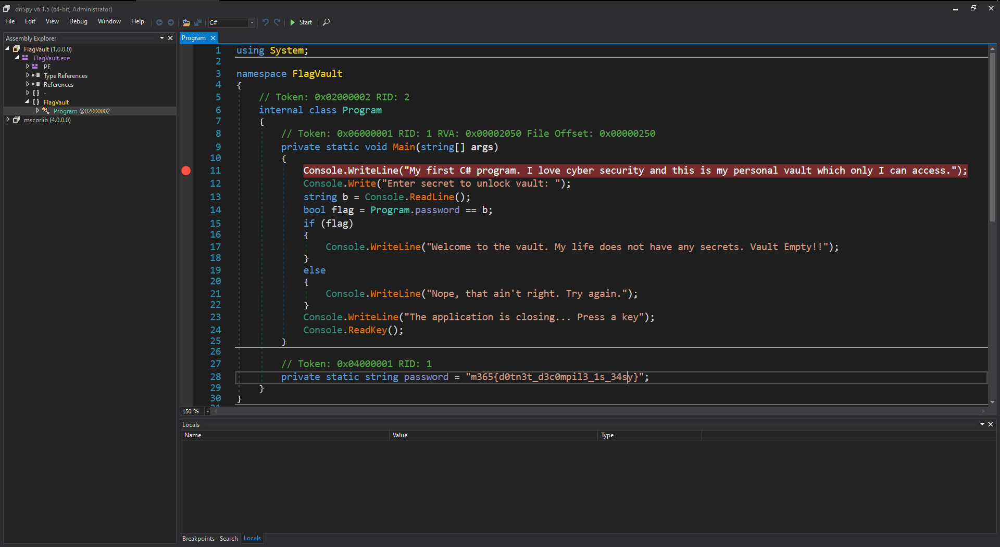
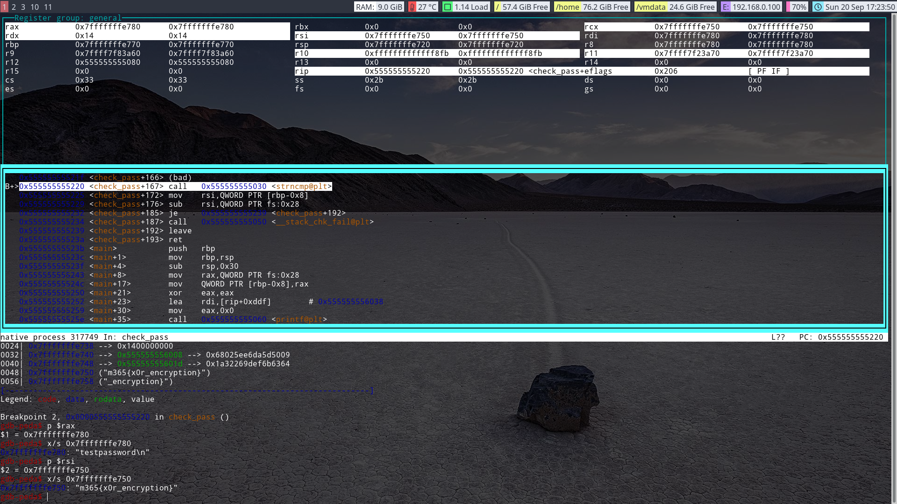
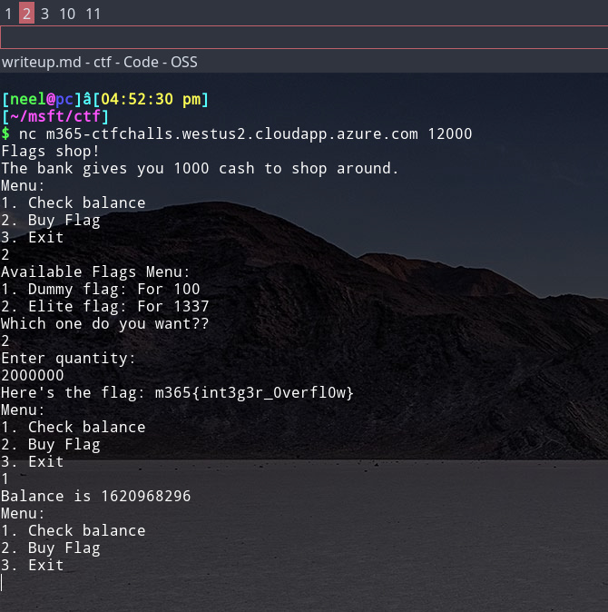
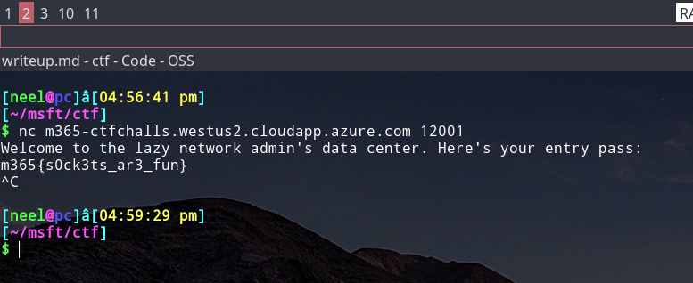
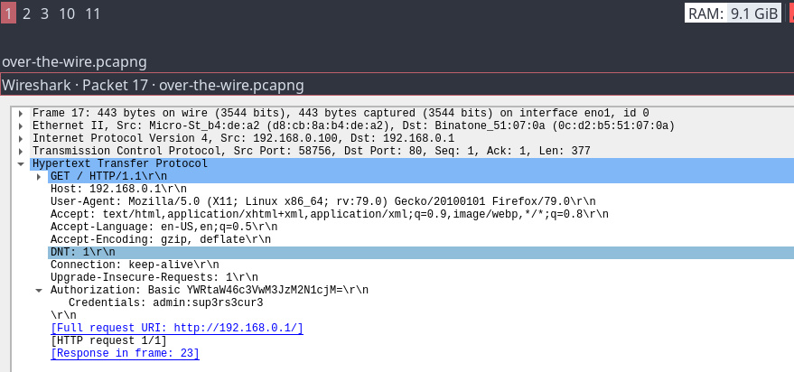
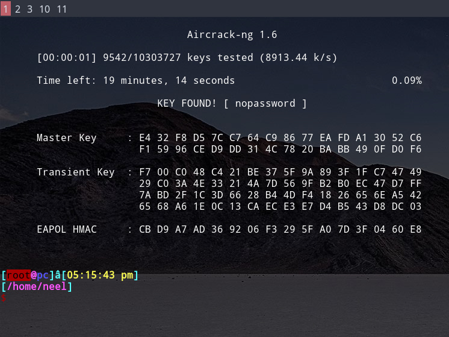

# Writeup for M365-CTF @ DOL september

## Answer to Web Category
---
### 1. Use the source Luke!

This challenge as the name suggests requires a look at the HTML sources. The first half of the flag is found in the main `index.html` file. The other half is found in the custom css file used for the styling @ `css/htmlstyles.css`.

### 2. Mr Robot!

The secrets are stored in the `robots.txt` file. The file contains to the flag file hidden in a peculiad directory. Visit the URL and you've got the flag.

### 3. Oom Nom Nom

Browsing the site with a proxy enabled shows an interesting cookie `admin=False`. Changing that to `admin=True` makes us the admin and gives the flag.

### 4. I'll only talk to Bing!

The site says that it'd like to talk to the "Bing" search engine. This challenge asks you to BE "Bing". All search engine crawlers have a special "User-Agent" header value. For example Google uses "GoogleBot" and similarly Bing's got "BingBot" as the user agent while Bing crawls the web. Changing the browser default "User-Agent" header to some string containing "bingbot" gives you the flag.

### 5. On my path to heaven

Visiting one of the "Books" page, we see a URL that looks like `http://HOST/book.php?name=death.php`. The bookname having a php extension points to a possible File Inclusion bug. File inclusion bugs allows you to read files from the server. You can give a path like `../../../../../../../etc/passwd` (A standard file on linux) to confirm the bug. The flag is found under `/etc/flag` as suggested by the hint that Neel reuses the flag paths. (Related to next challenge).

### 6. Play ping pong with me

This site let's you ping any ip address or hostname. And from the output you can see the internally the php calls "system" with the ping command and sends you the entire output. The sources on the HTML suggests that the flag is in the `/etc/flag`. You can try by giving `1.1.1.1;cat /etc/flag` as the input to see the command injection. This gives error that the `space` is not allowed in the input. You can easily bypass this using `cat</etc/flag` input. This works because you do not need spaces because `<` acts as the delimiter between the command and the file. There are many other ways to bypass the space restriction.

### 7. Ouch

This has the `Boolean Based Blind SQL Injection` bug. You can query the DB, but the application will give you only a "Yes/No" answer in terms of whether the condition evaluated to `True` (User Found) and `False` (Not Found). Using this bug you can try to exfiltrate data out by carefully querying the DB and extract out the admin's password which is the flag.

We can confirm the SQL injection point by passing `' or 1 = 1; #` as the input and getting a `User Found` response.

We can try this query to make sure we're on the right path `admin' and password like 'm365{%'` which get's you a `Found` as the output. This challenge involves some programming to automate this process by writing the quick script to automate exfiltration of each character of the password. For example to find the first character, you'd query ... 

`admin' and password like 'm365{a%'` gives `Not Found`

`admin' and password like 'm365{b%'` gives `Not Found`

... 

`admin' and password like 'm365{i%'` gives `Found`

and hence the first character is an 'I' in lowercase. Similarly automate for each character to get the flag.

---
## Answers to the Reversing category
---

### Flag Vault 1

Just open the exe in a dotnet decompiler. 

### Flag Vault 2

This one is not a C# code and hence the dotnet decompiler is of no use. Rather a generic machine code debugger is required. And you'd find a `strcmp` call being made. Put a breakpoint there and examine the register values for the arguments to `strcmp` call and find the strings stored at those address. The flag was stored in the code as a string which was `xored` with a key also hardcoded into the code. But as you are putting a breakpoint at the `strcmp`, the encrypted flag is already decrypted at the breakpoint. Giving you the easy way to obtain the flag.

---
## Answers to the Misc category
---

### Let's get cracking

You're just given a hash: `48adbc609c6f2ad2402a00a1ff2e607b`

Nothing fancy, just google the thing to see that it is the md5 hash for the `unsalted`. Reminding you to always secure the passwords with not just a hash but a strong and random `salt` as well.

### Base6464646464...

No amount of encoding provides any sort of confidentiality. See for yourself :)

The file contains a string which has been encoded ~30 times using the famous Base64 encoding algorithm. To get the flag; keep decoding until you find the flag.

### Flags on sale

This has an `interger overflow` error. The flag quantity is multiplied to the price of the flag before comparison. You can provide a "large enough" quantity which triggers an integer overflow, leading to the total amount required to buy the flag into negative. An example of such value of quantity is `2000000`. 

---
## Answers to Network category
---

### Can you net cat?

Just connect to the port and host specified to get the reward.

### The Matrix

This challenge was more of a troll than a real challenge :). The flag simply lies there in the big mess of the 0s and 1s. The flag is sent after sending ~1.5MB of `The Matrix`. Just dump the matrix for a while and do a text search of `m365{` for the flag. 

### Over the wire

The given pcap file contains a few HTTP requests made in plain text (No SSL). It also communicates to a site for which the 'Basic Authentication' is used. You can use the wireshark to find the credentials used in the authentication. The `Basic Auth` simple puts credentials in a `Username:Password` format and then encodes it with Base64.

### Can we handshake

This capture file contains some wireless packets. Most important packets are the ones in the beginning which contains a `4 way EAPOL handshake` used in the WPA2 i.e. the current WiFi security standard. Once the handshake is obtained, the password is only safe as the complexity of itself. The handshake can be used to crack the password using a tool called `Aircrack-ng` which is the swiss army knife of Wireless security testing. You can use any wordlist containing famous passwords and use the tool to crack the password. The password is `nopassword` and can be obtained in a few seconds of cracking.

---